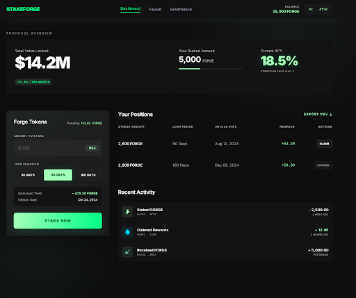

# ⚡ StakeForge — DeFi Staking dApp

A production-grade DeFi staking application built for the Sepolia testnet. Stake **SFORGE** tokens across multiple lock durations to earn tiered APY rewards.



> 🔴 Live Demo: [stake-forge.vercel.app](https://stake-forge.vercel.app) &nbsp;|&nbsp;
> 📄 Contract: [View on Etherscan](https://sepolia.etherscan.io/address/0xE275B6DAbd9025d57c6eeadcbe680c9278Ab681b)

---

## 🏗 Architecture

| Layer | Technology |
|-------|-----------|
| Smart Contracts | Solidity ^0.8.20, OpenZeppelin v5 |
| Development | Hardhat, Chai |
| Frontend | React + Vite, ethers.js v6 |
| Styling | Tailwind CSS v4 |
| Deploy Target | Sepolia Testnet |
| Network | Ethereum Sepolia Testnet (ChainId: 11155111) |

## 📦 Contracts

### SFORGEToken.sol
- **ERC-20** token — "StakeForge Token" (SFORGE)
- Initial supply: **1,000,000 SFORGE** minted to deployer
- Built-in `faucet()`: mints **1,000 SFORGE** per call (24h cooldown)

### StakeForge.sol
- Users stake SFORGE with a chosen lock duration:
  - **30 days** → 5% APY
  - **90 days** → 12% APY
  - **180 days** → 20% APY
- Rewards accrue **linearly per second** from stake time
- One active stake per address
- `claimRewards()` — claim accrued rewards anytime
- `unstake()` — withdraw principal + rewards after lock expires
- `getPendingRewards(address)` — view pending rewards
- `getTVL()` — total value locked

## 🚀 Quick Start

### Prerequisites
- Node.js ≥ 18
- MetaMask browser extension
- Sepolia ETH (from a faucet)

### 1. Install Dependencies
```bash
# Root (Hardhat)
npm install

# Frontend
cd frontend && npm install
```

### 2. Compile & Test Contracts
```bash
npx hardhat compile
npx hardhat test
```

### 3. Deploy to Local Network
```bash
npx hardhat node                          # Terminal 1
npx hardhat run scripts/deploy.js --network localhost  # Terminal 2
```

### 4. Deploy to Sepolia
```bash
# Set environment variables
export SEPOLIA_RPC_URL="https://eth-sepolia.g.alchemy.com/v2/YOUR_KEY"
export DEPLOYER_PRIVATE_KEY="0xYOUR_PRIVATE_KEY"

npx hardhat run scripts/deploy.js --network sepolia
```

### 5. Run Frontend
```bash
cd frontend
npm run dev
```
Open http://localhost:5173 in your browser.

### 6. Configure Frontend
After deploying, update the contract addresses in `frontend/src/config.js`:
```js
export const CONTRACTS = {
  SFORGE_TOKEN: "0xYOUR_DEPLOYED_TOKEN_ADDRESS",
  STAKE_FORGE:  "0xYOUR_DEPLOYED_STAKING_ADDRESS",
};
```

## 📍 Sepolia Contract Addresses

| Contract | Address | Etherscan |
|---|---|---|
| SFORGEToken | 0xDf6130dC8c88fe2A28170A0471b0E6898B50fbaA | [View](https://sepolia.etherscan.io/address/0xDf6130dC8c88fe2A28170A0471b0E6898B50fbaA) |
| StakeForge | 0xE275B6DAbd9025d57c6eeadcbe680c9278Ab681b | [View](https://sepolia.etherscan.io/address/0xE275B6DAbd9025d57c6eeadcbe680c9278Ab681b) |

## 🧪 Test Coverage

```
  StakeForge Protocol
    SFORGEToken
      ✓ should mint 1,000,000 SFORGE to deployer
      ✓ should have correct name and symbol
      Faucet
        ✓ should mint 1000 SFORGE to caller
        ✓ should emit Faucet event
        ✓ should NOT allow faucet twice within 24 hours
        ✓ should allow faucet again after 24 hours
    StakeForge Staking
      stake()
        ✓ should stake with 30-day duration at 5% APY
        ✓ should stake with 90-day duration at 12% APY
        ✓ should stake with 180-day duration at 20% APY
        ✓ should emit Staked event with correct params
        ✓ should update TVL after staking
        ✓ should revert if user already has an active stake
        ✓ should revert on zero amount
        ✓ should revert on invalid duration choice
      unstake()
        ✓ should NOT allow unstake before unlock time
        ✓ should allow unstake after unlock time and return principal + rewards
        ✓ should emit Unstaked event
        ✓ should reset TVL after unstake
        ✓ should revert if no active stake
      claimRewards()
        ✓ should claim accrued rewards without touching principal
        ✓ should emit RewardsClaimed event
        ✓ should track rewardsClaimed to prevent double-claiming
      Rewards calculation accuracy
        ✓ should accrue rewards correctly over time
        ✓ should return zero pending rewards for non-staker
      Reentrancy protection
        ✓ should have ReentrancyGuard on stake/unstake/claimRewards
      Edge cases
        ✓ should handle multiple users staking simultaneously
        ✓ should allow staking again after full unstake

  27 passing
```

## 🔒 Security Considerations

### ReentrancyGuard
All state-mutating functions (`stake()`, `unstake()`, `claimRewards()`) are protected with OpenZeppelin's `ReentrancyGuard` via the `nonReentrant` modifier. This prevents reentrancy attacks where a malicious contract could recursively call back into the staking contract during token transfers.

### SafeERC20
All ERC-20 token transfers use OpenZeppelin's `SafeERC20` library (`safeTransfer`, `safeTransferFrom`). This ensures:
- Tokens that don't return a boolean on `transfer()` are handled correctly
- Failed transfers always revert instead of silently failing
- Protection against non-standard ERC-20 implementations

### Custom Errors
The contracts use Solidity custom errors (`StakeAlreadyExists()`, `StakeLocked()`, `InsufficientBalance()`, etc.) instead of `require()` strings for:
- Gas efficiency (no string storage)
- Machine-readable error handling on the frontend
- Cleaner, more descriptive error reporting

### Additional Security Measures
- **Immutable staking token**: The `stakingToken` address is set in the constructor as `immutable`, preventing it from being changed after deployment
- **Integer overflow protection**: Solidity 0.8.x has built-in overflow/underflow checks
- **State changes before external calls**: The contracts follow the checks-effects-interactions pattern — e.g., `totalStaked` is decremented and the stake is deleted before transferring tokens in `unstake()`
- **No admin backdoors**: The contracts have no owner/admin functions that could rug-pull user funds

## 📁 Project Structure

```
StakeForge/
├── contracts/
│   ├── SFORGEToken.sol        # ERC-20 token with faucet
│   └── StakeForge.sol         # Staking contract
├── test/
│   └── StakeForge.test.js     # 27 tests, >80% coverage
├── scripts/
│   └── deploy.js              # Deployment script
├── frontend/
│   ├── src/
│   │   ├── abi/               # Contract ABIs
│   │   ├── components/        # React components
│   │   │   ├── Navbar.jsx
│   │   │   ├── HeroStats.jsx
│   │   │   ├── StakingPanel.jsx
│   │   │   ├── PositionsTable.jsx
│   │   │   ├── FaucetCard.jsx
│   │   │   ├── GovernancePage.jsx
│   │   │   └── DelegationModal.jsx
│   │   ├── hooks/             # Custom React hooks
│   │   ├── config.js          # Contract addresses & constants
│   │   ├── App.jsx            # Main application
│   │   └── index.css          # Forge Protocol design system
│   ├── index.html
│   └── vite.config.js
├── hardhat.config.js
└── README.md
```

## 🎨 Design Process

The frontend UI was designed using **Google Stitch** (AI-driven
UI generation via natural language prompts), then implemented
pixel-perfect in React + Tailwind via **Antigravity MCP**.
The raw Stitch design exports are preserved in `/stitch-screens`
for reference.

## 📝 License

MIT
